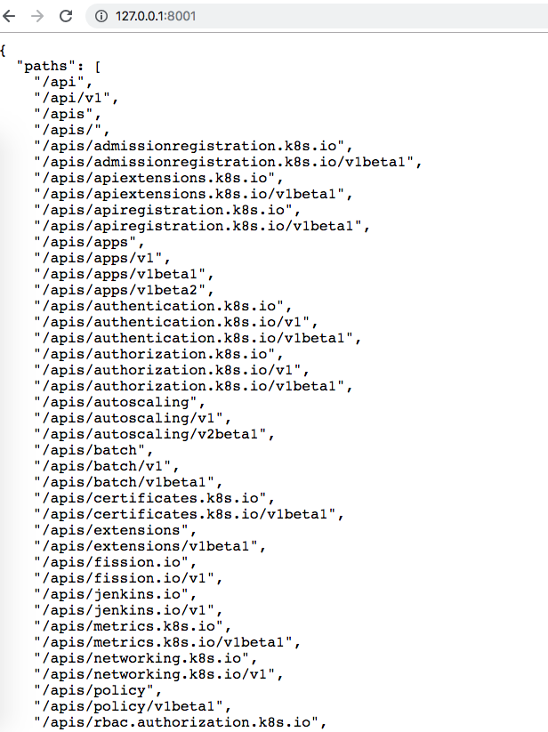

# Interacting with Kubernetes

## API

- API demo with proxy

```
$ kubectl proxy
Starting to serve on 127.0.0.1:8001
```



## Kubectl

- Quick overview of Kubectl couple of sample commands

- Getting objects in Kubernetes - `kubectl get OBJ_TYPE`

```
$ kubectl get pod 
NAME                                                READY     STATUS      RESTARTS   AGE
jenkins-6dd96c8f8d-5rl5w                            1/1       Running     0          3d
jenkins-x-chartmuseum-5b6f9fd646-bjlb2              1/1       Running     0          2d
jenkins-x-controllercommitstatus-77854ddcf6-zf6gz   1/1       Running     0          3d
```

- Or if you want to get all object types:


```
$ kubectl get
You must specify the type of resource to get. Valid resource types include: 

  * all  
  * certificatesigningrequests (aka 'csr')  
  * clusterrolebindings  
  * clusterroles  
  * componentstatuses (aka 'cs')  
  * configmaps (aka 'cm')  
  * controllerrevisions  
  * cronjobs  
  * customresourcedefinition (aka 'crd')  
  * daemonsets (aka 'ds')  
  * deployments (aka 'deploy')  
  * endpoints (aka 'ep')  
  * events (aka 'ev')  
  * horizontalpodautoscalers (aka 'hpa')  
  * ingresses (aka 'ing')  

```

To run things 

```
$ kubectl run nginx --image=nginx --dry-run
NAME      AGE
nginx     <unknown>
```

There are lot more commands - we will revisit again!


## SDK

- Go client for Kubernetes: https://github.com/kubernetes/client-go 
- Python client for Kubernetes: https://github.com/kubernetes-client/python 